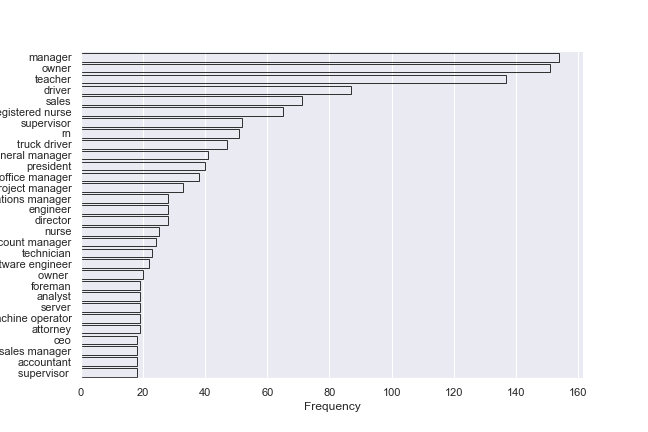
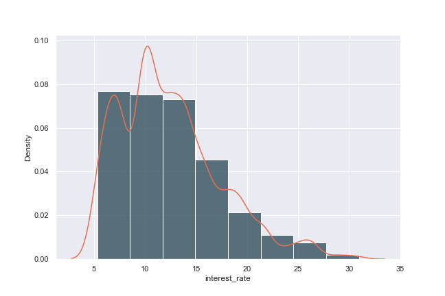
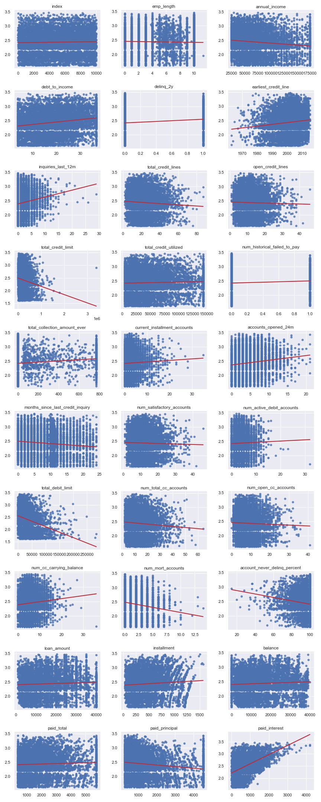
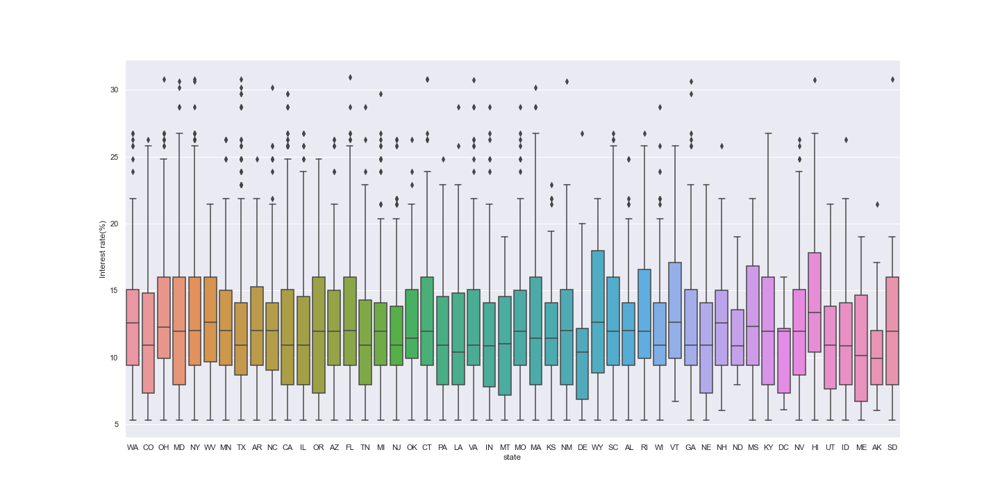

# Case Study 1

## Describe the dataset and any issues with it.

### Data description and issues

This Dataset records the loan-related information from Lending Club with 55 columns and 10000 rows. The response variable is `Interest rate`. The data sources is [OpenIntro](https://www.openintro.org/data/index.php?data=loans_full_schema). 

#### Problem1: Missing values

<p align = "center">

</p>
<p align = "center"> 
Figure 1 - Missing values profiling  </p> 

The first question of this dataset is about missing values.  There are five columns with more than 50% missing values. These columns could be dropped or filled with special values.

<p align = "left"> 
Table 1 - Missing values profiling  </p> 

```
verification_income_joint           0.8545
debt_to_income_joint                0.8505
annual_income_joint                 0.8505
months_since_90d_late               0.7715
months_since_last_delinq            0.5658
```

#### Problem2: Low cardinality variables

<p align = "center">

</p>
<p align = "center"> 
Figure 2 - Histgram of all variables  </p> 

The second problem in this dataset is the data variable distribution. Since we assume all the variable is normally distributed, it is necessary to transfer these skewed variables into a normal distribution with some special techniques, such as the log transformation.

#### Problem3: Sparsity variables

<p align = "center">

</p>
<p align = "center"> 
Figure 3 - Histgram of sparsity variables  </p> 
The third problem in this dataset is the sparsity of the variable. As shown in the above plot, most of the values in `emp_title` is concentrated in the top 10 job title, such as the manager, owner, teacher....

 To solve this data issue, it may need to combine some less frequent values together.

#### Problem4: Useless columns

| Index | num_collections_last_12m | current_accounts_delinq | num_accounts_120d_past_due | num_accounts_30d_past_due | tax_liens |
| ----: | -----------------------: | ----------------------: | -------------------------: | ------------------------: | --------- |
|     0 |                      0.0 |                     0.0 |                        0.0 |                       0.0 | 0.0       |
|     1 |                      0.0 |                     0.0 |                        0.0 |                       0.0 | 0.0       |
|     2 |                      0.0 |                     0.0 |                        0.0 |                       0.0 | 0.0       |
|     3 |                      0.0 |                     0.0 |                        0.0 |                       0.0 | 0.0       |
|     4 |                      0.0 |                     0.0 |                        0.0 |                       0.0 | 0.0       |
|   ... |                      ... |                     ... |                        ... |                       ... | ...       |
|  6995 |                      0.0 |                     0.0 |                        0.0 |                       0.0 | 0.0       |
|  6996 |                      0.0 |                     0.0 |                        0.0 |                       0.0 | 0.0       |
|  6997 |                      0.0 |                     0.0 |                        0.0 |                       0.0 | 0.0       |
|  6998 |                      0.0 |                     0.0 |                        0.0 |                       0.0 | 0.0       |
|  6999 |                      0.0 |                     0.0 |                        0.0 |                       0.0 | 0.0       |

`num_collections_last_12m`, `current_accounts_delinq`, `num_accounts_120d_past_due`, `num_accounts_30d_past_due`, `tax_liens`,  `paid_late_fees` is all zeros where these columns should be dropped during the modelling process.

## Observations

### Response distribution is skewed.
<p align = "center">

</p>
<p align = "center"> 
Figure 4 - Histgram of response  </p> 
The distribution of response is skewed (as shown in the plot), `Log transformation` may be implemented to help normalized the response.

### Regression plot

<p align = "center">

</p>
<p align = "center"> 
Figure 5 - Mutiple regression plot with response  </p> 
Most of the variables have a weak relationship with the response. `total_credit_limit` has a clear negative relationship with the response.`paid_intest` has a clear positive relationship with the response. The remaining variables contribute less to the interest rate

### Heatmap

<p align = "center">

</p>
<p align = "center"> 
Figure 6 - Heatmap  </p> 

From the above heatmap, there are clearly several highly correlated variables: `balance`, `installment`, `loan_amount`....

These highly correlated variables will break the assumption in linear regression(heteroscedastic). Therefore we may drop these columns.

### Geographic plot against interest rate

<div align="center"> <iframe src="doc/interest_rate.html" width="90%" height="400"> </iframe> <p align = "center"> Figure 7 - Interest rate map</p>

The North Dakota has the highest interest rate while the Maine has the lowest interest rate. The above interactive plot could help users explore more insights.

### Boxplot between different state
<div align = "center">

</doiv>
<p align = "center"> 
Figure 6 - Boxplot between different states  </p> 

The above box plot shows the interest rate distribution between different states. The interest rate in `AK`  is much more concentrated than in other states. Beyond that, different states have different value distributions, which implies the LDA method could perform well in this dataset. However, this code did not apply the LDA method but encoding the state as the dummy variables.

## Modelling

### Model result: Lasso+random forest.

|       |        model |         MAPE |           R2 |
| ----: | -----------: | -----------: | -----------: |
|     0 |        lasso |     0.051143 |     0.924936 |
|     1 |         enet |     0.051257 |     0.924712 |
|     2 |         tree |     0.000522 |     0.999875 |
|     3 |     rf_model |     0.008468 |     0.990391 |
| **4** | **lasso+rf** | **0.028766** | **0.965907** |

### Data feature engineering


| Data processing              | Method                                         | Explanation                                                  |
| ---------------------------- | ---------------------------------------------- | ------------------------------------------------------------ |
| Numerical missing values     | `IterativeImputer`, `enable_iterative_imputer` | Since there are only 10 thousand rows of data, Imputation on the missing value could be a good way to handle the missing values keeping the data quality. |
| Categorical missing values   | Replace `NaN` with `'Missing'`                 | Sometimes the missing values could also imply some information. |
| Response skewed distribution | `Log transformation`                           | Log transformation performs will on skewed distribution.     |
| String variables             | `Dummy encoding`                               | As shown in the above plot, it will be useful to encode the `state` with a dummy encoding method, and so does that of other string variables. |
| Scaling with features        | `Normalization`                                | `Normalization` on the feature set could help improve the accuracy result from the effect of outliers |

### Fianl prediction vs True values

| index | Final prediction | True test values |
| ----: | ---------------: | ---------------: |
|     0 |         6.312073 |             6.08 |
|     1 |        14.517657 |            15.04 |
|     2 |        14.565900 |            15.04 |
|     3 |         7.491747 |             7.96 |
|     4 |        13.551010 |            13.59 |
|   ... |              ... |              ... |
|  2995 |        10.589689 |            10.42 |
|  2996 |        12.756806 |            12.62 |
|  2997 |         7.736285 |             7.97 |
|  2998 |        10.683247 |            10.90 |
|  2999 |         7.320644 |             7.35 |

## Assumption

* All the numerical predictors are normally distributed
* All the predictors are not highly correlated (Homoscedasticity)
* Stacking models has better robust

## Future improvement

* ANN neural network modelling could be tried as they may has better performance in such structured dataset.
* Do a cross validation for better parameters


